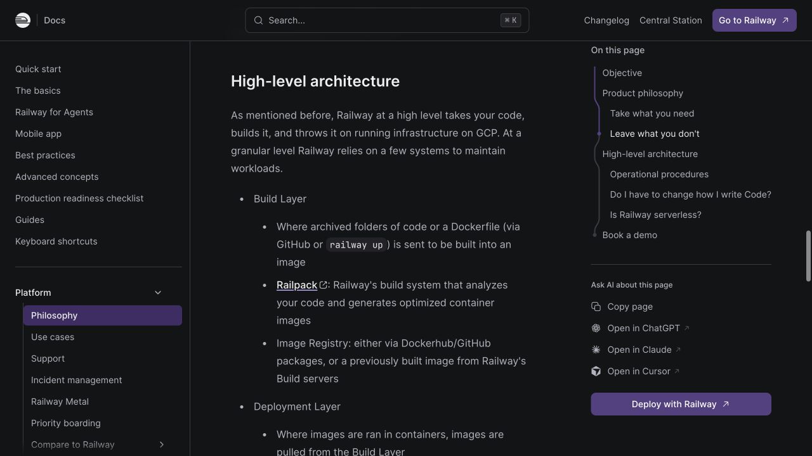
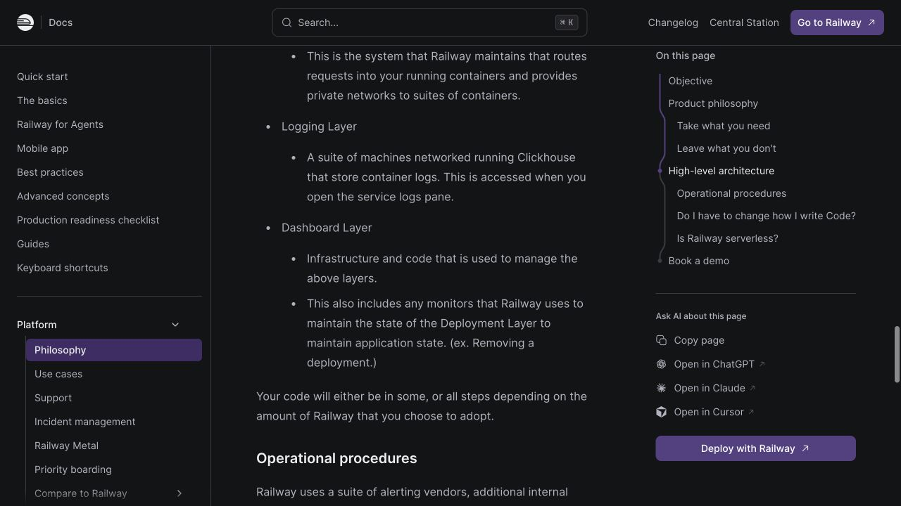

# Railway: Product and Architecture Plan

Railway is a developer-focused cloud platform for shipping applications without making teams assemble and operate the underlying infrastructure themselves.

## Core idea

Connect an application source, then let Railway turn it into a running service. Railway detects how the project should be built, deploys it, provides networking, and keeps operational controls in one place.

> Move from code to a production service with minimal infrastructure configuration.

## Railway's documented architecture

The following screenshot was captured from Railway's official [Philosophy documentation](https://docs.railway.com/platform/philosophy#high-level-architecture) on July 30, 2026.





Railway publicly describes five major layers:

1. **Build layer** — receives source archives or Dockerfiles, uses Railpack when appropriate, and produces container images.
2. **Deployment layer** — pulls images and runs services, databases with attached volumes, and scheduled containers.
3. **Routing layer** — routes public requests and supplies private networking between related containers.
4. **Logging layer** — collects container logs into a networked ClickHouse deployment.
5. **Dashboard layer** — manages the other layers and monitors runtime state so desired application state is maintained.

## User-facing workflow

```text
GitHub repository / Docker image / Railway CLI
                       |
                       v
             Source and config intake
                       |
                       v
        Railpack detection or Dockerfile build
                       |
                       v
              OCI container image
                       |
                       v
        Scheduler selects region and runtime host
                       |
                       v
           Container starts with variables,
             secrets, network and volume
                       |
                       v
                Health check passes
                       |
                       v
         Router sends traffic to new deployment
                       |
                       v
      Logs, metrics, alerts, usage and rollbacks
```

## What Railway brings together

- Deployments from GitHub repositories, Docker images, templates, functions, or the CLI
- Managed databases and persistent storage alongside application services
- Public domains, private service networking, TLS, and load balancing
- Environment variables and separate development, preview, and production environments
- Logs, metrics, alerts, scaling, rollbacks, and deployment history
- A visual project canvas that shows how services and resources connect

## How a Railway-like platform can be built

The sections below are an architectural reconstruction based on Railway's documented behavior. They are design inferences, not claims about every private implementation detail.

### 1. Product control plane

The control plane is the source of truth for:

- users, workspaces, projects, and permissions
- environments, services, variables, and secrets
- source connections and deployment configuration
- domains, volumes, replicas, and regions
- deployment history, usage, limits, and billing

A relational database can store the desired state. Dashboard and API actions should create durable commands or events rather than directly controlling machines.

### 2. Deployment orchestrator

A Git push or CLI deployment should create an idempotent pipeline:

```text
Webhook or upload
  -> deployment record
  -> immutable source snapshot
  -> build job
  -> image publication
  -> runtime scheduling
  -> health verification
  -> traffic switch
  -> old deployment teardown
```

Every step needs retry handling, timeouts, event history, and a stable idempotency key so repeated webhooks cannot create accidental duplicate releases.

### 3. Isolated build plane

Build workers execute untrusted customer code, so they should be ephemeral and strongly isolated.

The build system should:

1. Inspect the repository.
2. Prefer an explicit Dockerfile when supplied.
3. Otherwise detect language and framework through a Railpack-like system.
4. Resolve runtimes and dependencies.
5. generate build and start commands.
6. Produce an OCI-compatible image.
7. Push the immutable image to a registry.

Build caching can be keyed by source revision, dependency manifests, build configuration, and relevant variables.

### 4. Scheduler and runtime hosts

The scheduler selects placement using:

- requested region
- available CPU and memory
- replica count
- volume locality
- runtime compatibility
- failure-domain distribution
- customer plan and resource limits

Each host can run a trusted reconciliation agent responsible for pulling images, starting containers, applying limits, injecting configuration, mounting volumes, reporting health, and forwarding telemetry.

### 5. Networking and service discovery

Public traffic follows a path similar to:

```text
Internet
  -> global or regional edge
  -> TLS and domain lookup
  -> healthy deployment and replica selection
  -> application container
```

Private traffic requires isolated environment-level service discovery. Railway documents internal DNS and encrypted WireGuard networking, which allows services such as `api` and `database` to communicate without exposing ports publicly.

### 6. Safe deployments and rollback

A zero-downtime deployment should:

1. Start the new container without changing live traffic.
2. Wait for readiness and health checks.
3. Register healthy replicas with the router.
4. Switch or gradually shift traffic.
5. Drain connections from the previous deployment.
6. Retain the prior image and configuration for rollback.

If readiness fails, the active deployment must remain untouched.

### 7. Persistent storage

Volumes turn a stateless scheduler into a stateful infrastructure system. The platform needs explicit policies for:

- host and region affinity
- snapshots and backups
- restore verification
- host failure and volume reattachment
- data migration
- database maintenance

Databases can be represented as container images with persistent volumes, but production quality depends more on backup, recovery, upgrade, and failure procedures than on initial provisioning.

### 8. Observability

Build workers, runtime hosts, and routers should emit structured events carrying workspace, project, environment, service, deployment, and replica identifiers.

The observability pipeline combines:

- build and deployment logs
- application standard output and error
- CPU, memory, disk, and network metrics
- router request and latency metrics
- deployment state transitions
- alerts and incident signals

Logs and metrics must be tenant-scoped before they reach query APIs.

### 9. Usage, billing, and safety

Runtime measurements feed a separate usage ledger:

```text
Resource measurements
  -> durable usage events
  -> aggregation
  -> customer ledger
  -> limits and spending controls
  -> invoice provider
```

Secrets should be encrypted at rest, access should be audited, and build-time secret access should be separated from runtime access. Isolation must exist at the authorization, compute, network, filesystem, and telemetry layers.

## Why this matters for Imperyn

Railway can serve as Imperyn's initial execution layer while the product is young. The application, API, workers, and databases can live in one visible project so the team can focus on product behavior before operating custom infrastructure.

Imperyn should still keep its service boundaries, data model, and configuration portable. Railway is an execution and operations layer, not the product architecture.

The deeper lesson for Imperyn is that Railway's main value is not simply running containers. Its value is the reconciliation loop that absorbs operational complexity:

```text
User intent
  -> inferred infrastructure
  -> safe execution
  -> observable state
  -> automatic recovery
```

## Practical starting point

1. Keep every deployable service in Git with a clear start command or Dockerfile.
2. Create one Railway project and connect the repository.
3. Add databases and internal services as separate project services.
4. Configure variables, reference variables, health checks, and restart behavior.
5. Expose only public-facing services and use private networking internally.
6. Enable preview deployments, resource limits, alerts, backups, and a spending limit.
7. Record assumptions that would make later migration difficult.

## References

- [Railway platform philosophy and architecture](https://docs.railway.com/platform/philosophy)
- [Railpack build system](https://docs.railway.com/builds/railpack)
- [Build and deployment concepts](https://docs.railway.com/build-deploy)
- [Private networking architecture](https://docs.railway.com/networking/private-networking/how-it-works)
