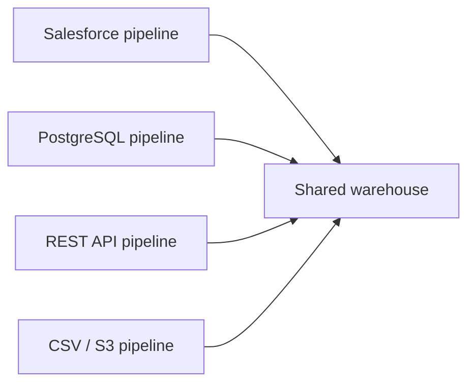
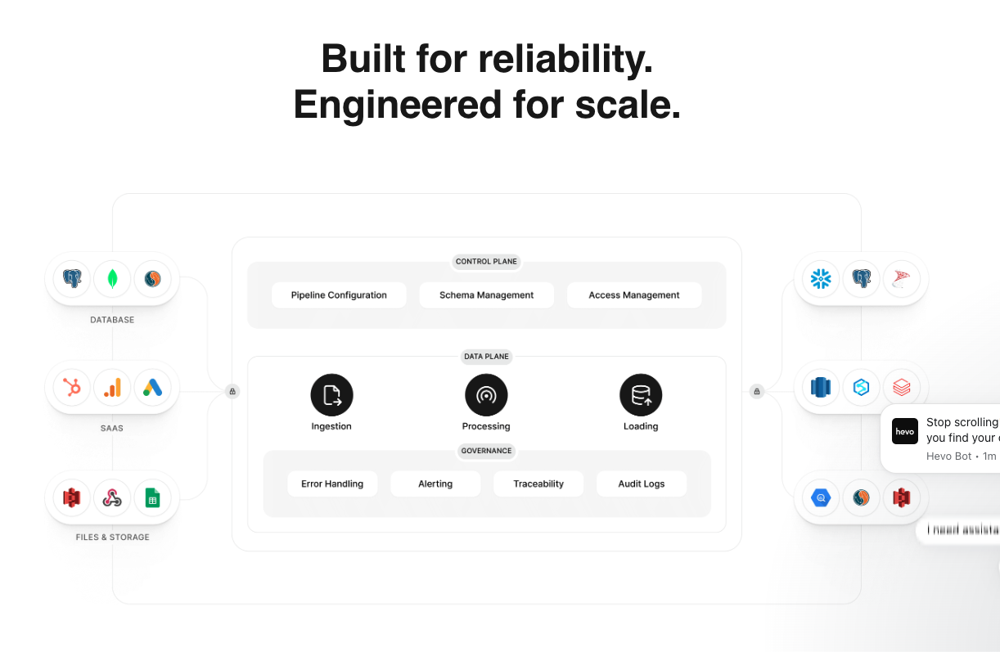
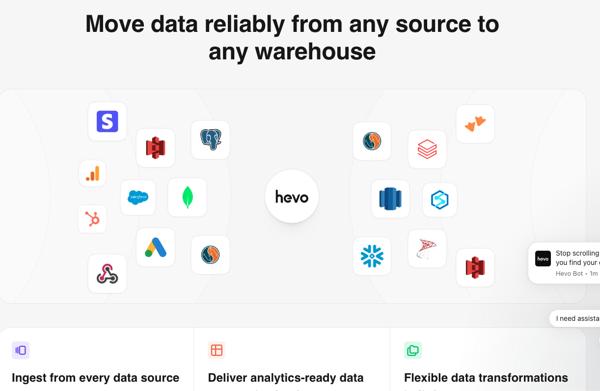
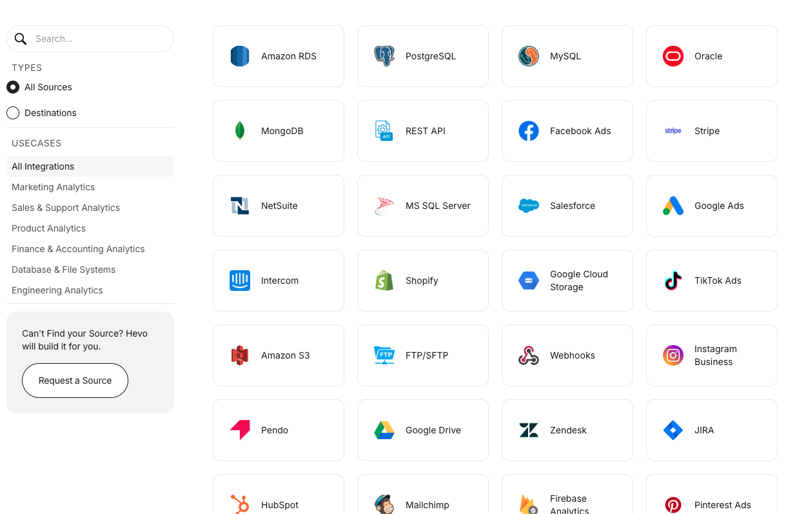
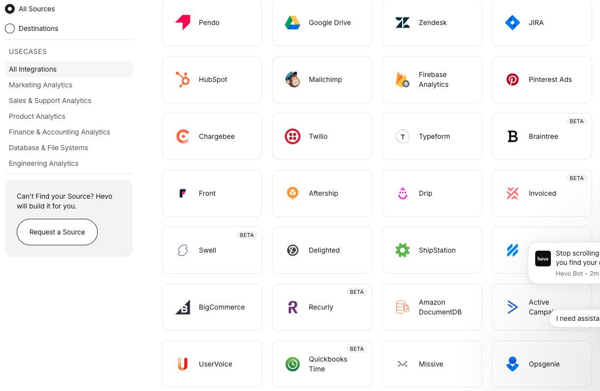
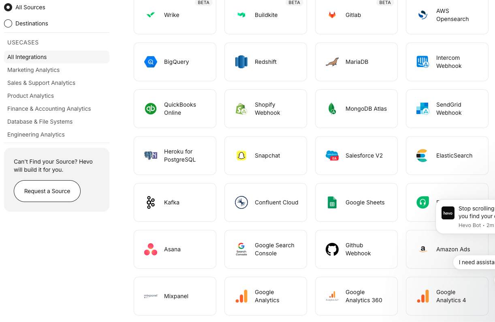
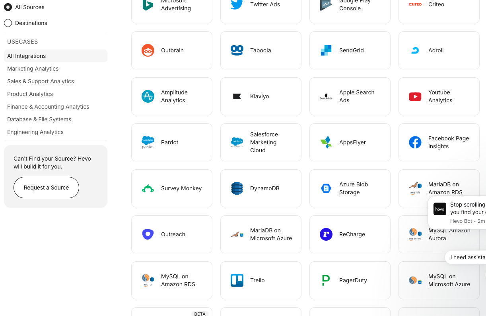
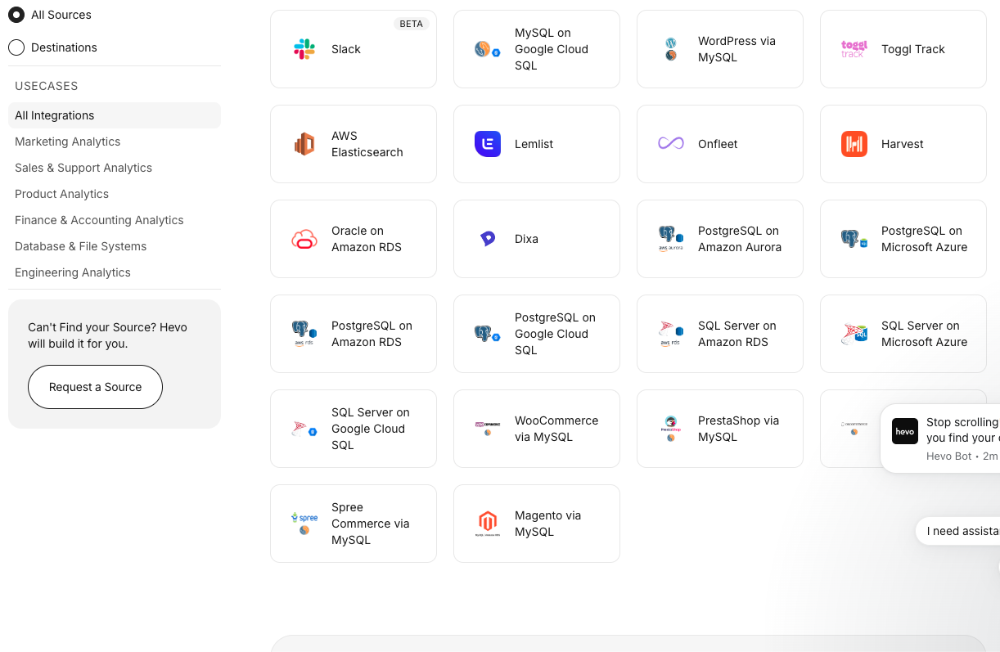

# Hevo: Connect → Pull → Schedule

Hevo’s core concept is an automated data-integration pipeline:

**Connect → Select data → Pull/stream → Normalize → Load → Repeat on schedule**

A useful way to think about it is: **one Hevo pipeline connects one source to one destination**, but that pipeline can pull multiple objects or tables. To combine many sources, you create multiple pipelines and point them at the same destination. [Hevo Pipelines documentation](https://docs.hevodata.com/pipelines/)



## Screenshots

Captured 2026-07-30 from Hevo’s public product and marketing surfaces.

### Architecture



### Source → warehouse



### Select source catalog











## How Hevo performs multiple data pulls

There are two levels:

- **Inside one pipeline:** select multiple tables, API objects, collections, or files.
- **Across connectors:** create a pipeline for each source and send all pipelines to the same warehouse.

Each selected object has its own ingestion state, such as scheduled, bootstrapping, streaming, paused, or skipped. A scheduled job can process all selected objects, while an individual object can also be run manually. [Pipeline scheduling](https://docs.hevodata.com/pipelines/working-with-pipelines/scheduling-a-pipeline/)

## The three essential product areas

### 1. Connect

Hevo supports several connector families:

| Source type | Typical connection |
|---|---|
| SaaS applications | OAuth 2.0 or API credentials |
| REST APIs | URL, method, headers, auth and pagination |
| SQL databases | Host, port, database and credentials |
| CDC databases | Database transaction logs |
| Files/cloud storage | Bucket, folder and file-pattern configuration |
| Webhooks | Public receiving endpoint |
| Kafka/streams | Broker and topic configuration |

Common authentication methods include:

- OAuth 2.0
- API key
- Bearer token
- Basic authentication
- Database username/password
- SSH tunnel
- TLS certificates
- Cloud IAM roles or service accounts

A connector should always have a **Test connection** action before users save it.

### 2. Pull

Hevo uses several ingestion strategies. [Hevo ingestion modes](https://docs.hevodata.com/data-ingestion/ingestion-modes-and-query-modes/)

| Pull mode | How it works | Best use |
|---|---|---|
| Full pull | Downloads everything every run | Small or unchangeable datasets |
| Incremental cursor | Pulls records after the last ID or timestamp | Most APIs and tables |
| CDC/log-based | Reads transaction logs | High-volume databases |
| Table polling | Queries selected tables periodically | Simple database integration |
| Custom SQL | Runs a user-provided query | Views or filtered/joined datasets |
| Webhook/push | Source sends changes immediately | Event-driven systems |

Hevo separates data into:

- **Historical:** existing data pulled during the initial run.
- **Incremental:** new or updated data fetched afterward.
- **Refresher:** periodic re-fetching of recent data, useful for advertising and analytics systems where past attribution can change. [Data ingestion concepts](https://docs.hevodata.com/data-ingestion/)

For databases, log-based CDC can capture inserts, updates and deletes. Timestamp polling normally cannot identify hard deletes.

### 3. Schedule

Hevo supports:

- Fixed intervals, such as every 30 minutes
- Every N hours
- Daily schedules
- Manual **Run now**
- Near-real-time or continuous ingestion for certain sources
- Independent destination loading schedules

Webhooks and Kafka are push-based, so they do not need a polling schedule. Some SaaS sources restrict available frequencies because of API rate limits. [Scheduling a Pipeline](https://docs.hevodata.com/pipelines/working-with-pipelines/scheduling-a-pipeline/)

## Universal connector model

If you are building a Hevo-like system, use one normalized connector contract for every source:

```text
Connection
├── connector_type
├── authentication
├── network configuration
└── credentials reference

Pull configuration
├── resources/objects
├── request or query
├── pagination strategy
├── incremental cursor
├── initial-sync behavior
└── destination mapping

Schedule
├── interval or cron
├── timezone
├── retries
├── timeout
└── concurrency limit

Runtime state
├── last successful cursor
├── next page token
├── last run time
├── schema version
└── error/retry state
```

Every connector should implement roughly the same operations:

```ts
interface Connector {
  testConnection(): Promise<TestResult>;
  discover(): Promise<Resource[]>;
  readSchema(resource: Resource): Promise<Schema>;
  pull(request: PullRequest): AsyncIterable<RecordBatch>;
  refreshCredentials(): Promise<void>;
}
```

`PullRequest` should contain the resource, cursor, time range, page token and batch size. The connector returns records plus a checkpoint that the platform stores only after a successful load.

## Universal ways to connect different data

You will cover most systems with these five approaches:

1. **Prebuilt connectors**  
   A dedicated connector for Salesforce, Stripe, PostgreSQL, HubSpot, and similar systems.

2. **Generic REST connector**  
   Configure URL, HTTP method, headers, authentication, response data path and pagination. Hevo’s REST connector supports common pagination patterns, but its generic connector may re-fetch all records when it cannot identify incremental changes. [Hevo REST API connector](https://docs.hevodata.com/sources/engg-analytics/streaming/rest-api/)

3. **Database connector**  
   Use JDBC/ODBC-style configuration, table discovery, primary keys, timestamps and optionally CDC.

4. **File connector**  
   Read CSV, JSON, Parquet or Avro from uploads, SFTP or cloud object storage.

5. **Webhook receiver**  
   Give the source a URL and ingest events as they arrive.

## Important features surrounding Connect–Pull–Schedule

A production-quality platform also needs:

- Schema discovery and automatic mapping
- Field selection and filtering
- Historical backfill
- Incremental checkpoints
- Pagination
- API rate-limit handling
- Credential refresh
- Retries with exponential backoff
- Idempotency and deduplication
- Upsert, append and delete handling
- Schema-drift detection
- Run history and per-object logs
- Failed-record storage and replay
- Alerts for failures and latency
- Pause, resume, restart and run-now controls
- Role-based access and encrypted secrets
- Usage and cost visibility

Hevo automatically maps source fields to destination tables and can create compatible destination columns. It also surfaces failed events for correction and replay. [Schema Mapper](https://docs.hevodata.com/pipelines/schema-mapper/), [failed-event handling](https://docs.hevodata.com/pipelines/failed-events-in-a-pipeline/)

One current product detail: Hevo’s older pre-load transformation feature is no longer available for creating or editing transformations; its documentation directs users toward dbt or SQL Models instead. [Hevo Transformations](https://docs.hevodata.com/pipelines/transformations/)

## Recommended UX for your interface

The cleanest setup wizard is:

1. **Choose source**
2. **Authenticate and test**
3. **Select objects**
4. **Choose Full, Incremental, or CDC**
5. **Configure cursor and pagination**
6. **Choose destination**
7. **Map schema**
8. **Set schedule**
9. **Review estimated volume**
10. **Create pipeline**

Your top-level product navigation could be:

- Connections
- Pulls/Pipelines
- Schedules
- Destinations
- Runs
- Alerts

The key design principle is to keep **connection credentials reusable**, while each pull separately owns its selected objects, cursor, destination, and schedule. This lets one Salesforce connection support several independent pulls without asking the user to authenticate repeatedly.
