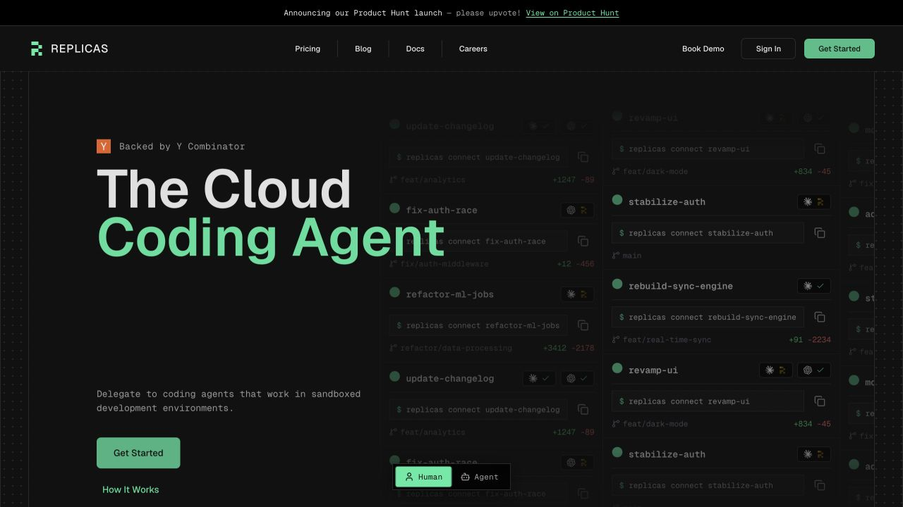
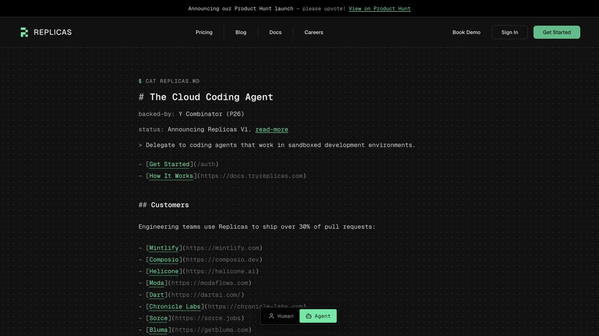
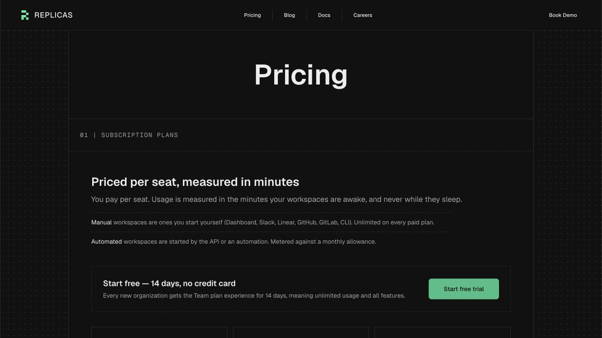
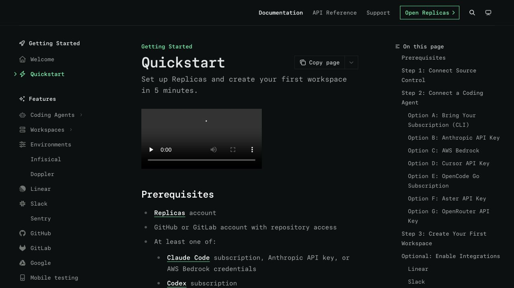
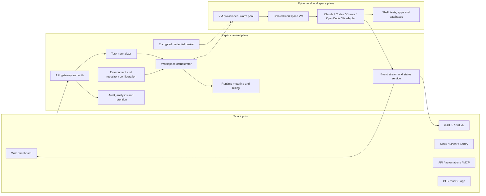
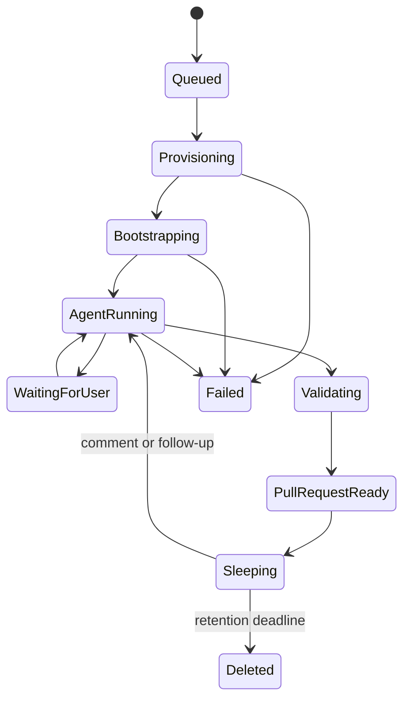

# Replica: product and architecture teardown

Captured 2026-07-30 from the public website and documentation.

Replica appears to be a **control plane for cloud coding agents**. It receives engineering tasks from several surfaces, prepares an isolated development environment, launches a selected coding-agent runtime, streams progress, and converts successful work into a pull request or merge request.

This document separates directly observed behavior from architectural inference. Replica's private implementation and infrastructure are not publicly visible.

## Screenshots

### Product homepage



### Agent-readable homepage

The Human/Agent switch replaces the visual marketing page with a compact, Markdown-like product description. This is both a UX feature and an agent-discovery strategy.



### Pricing model



### Five-minute onboarding



## Confirmed public signals

- The marketing application is built with **Next.js**; its public asset URLs use `/_next/static/`, and a Turbopack chunk is loaded.
- Documentation is hosted with **Mintlify**.
- Supported source-control systems include GitHub and GitLab.
- Task inputs include the dashboard, GitHub/GitLab mentions, Linear, Slack, CLI, MCP, Sentry, Google Drive, API calls, and automations.
- Supported agent runtimes include Claude Code, Codex, Cursor, OpenCode, and Pi.
- Each task runs in an isolated workspace described as a VM containing code, dependencies, local applications, and databases.
- Users can supply agent subscriptions or credentials. Published options include Claude and Codex subscription authentication, Anthropic, AWS Bedrock, Cursor, OpenCode Go, Aster, and OpenRouter.
- Repository configuration supports startup commands and a custom system prompt through `replicas.json` or `replicas.yaml`.
- Public admin concepts include organizations, members, environments, credentials, defaults, audit logs, analytics, billing, and data-retention controls.
- Public pricing distinguishes manually launched workspaces from API/automation-launched workspaces. This suggests trigger provenance is retained for metering.
- Replica says credentials are encrypted and only accessed while provisioning workspaces. It also says sleeping workspaces are automatically deleted after seven days of inactivity.

## Likely architecture



### 1. Multi-tenant control plane

The dashboard, integrations and public API likely converge on one authenticated API. Incoming payloads are normalized into a common task record containing organization, actor, repository or repository set, environment, agent, prompt, trigger type, and delivery target.

A relational database such as PostgreSQL would be a natural fit for organizations, repositories, configuration, tasks, workspace state, billing records, and audit events. This database choice is an inference, not a public claim.

### 2. Event-driven orchestration

Workspace creation is slow and failure-prone compared with a normal HTTP request, so it is probably asynchronous. A queue or durable workflow engine likely drives a state machine resembling:



A durable workflow system would help with retries, timeouts, cancellation, machine cleanup, warm-pool allocation, and restoring workspaces when comments arrive later. Likely implementation candidates include Temporal, a cloud queue plus workers, or a database-backed job system; the exact technology is unknown.

### 3. Workspace provisioning plane

The provisioner probably performs these steps:

1. Allocate a fresh VM or claim a pre-warmed VM.
2. Create short-lived source-control credentials and clone the selected repository or repository set.
3. Inject narrowly scoped agent/provider credentials and repository secrets.
4. Apply the selected environment plus `replicas.json` or `replicas.yaml` hooks.
5. Start the coding-agent adapter and stream structured events to the control plane.
6. Expose local services or previews through an authenticated proxy when required.
7. Commit and push changes through a bot identity, then open or update a PR/MR.
8. Stop billing when the workspace sleeps and destroy it at the retention deadline.

The isolated runtime should communicate outward through short-lived tokens. The control plane should avoid maintaining permanent inbound access to individual VMs.

### 4. Agent abstraction

Multiple supported coding agents imply a common adapter contract. A plausible internal interface is:

```text
AgentAdapter
  authenticate(credential_reference)
  start(prompt, workspace_context)
  send_follow_up(message)
  stream_events()
  cancel()
  summarize_result()
```

The platform probably stores canonical events such as tool start, tool completion, message delta, approval request, file change, test result, failure, and completion. The dashboard can render those events consistently even when the underlying CLI output differs.

### 5. Integration adapters

Each external integration likely has three layers:

- webhook verification and event deduplication;
- translation into the common task/comment model;
- delivery of progress, links, reactions, and final PR status back to the source.

GitHub and GitLab additionally require installation/project authorization, bot identities, branch creation, comments, checks, and PR/MR creation. Linear and Slack primarily act as task-intake and status surfaces.

### 6. Credential and security boundary

The highest-risk component is the credential broker. A defensible design would keep encrypted credentials in a secrets service backed by KMS, decrypt only for a specific provisioning request, issue short-lived tokens whenever providers allow it, redact secrets from event streams, and destroy workspace-local copies during sleep or teardown.

Public statements establish VM isolation, encrypted credentials, no database storage of repository code, and seven-day deletion of sleeping workspaces. They do not establish the hypervisor, cloud vendor, network policy, encryption implementation, tenant-isolation tests, or the exact meaning of “code never leaves your connected repository.” Those would require a security review or architecture disclosure.

## Likely frontend structure

The public Next.js application probably contains:

- server-rendered marketing and pricing routes;
- authentication and onboarding routes;
- a client-heavy dashboard with organization, environment, integration and agent settings;
- a workspace conversation view driven by streaming events;
- a code diff and plan view;
- API routes or a separate backend service for authenticated operations.

The dashboard likely uses WebSockets or server-sent events for agent progress. The precise protocol is not visible publicly.

## Minimum viable implementation

An MVP with similar behavior could use:

- Next.js for marketing, onboarding and dashboard UI;
- PostgreSQL for tenants, tasks, workspaces and audit records;
- a durable queue or Temporal for orchestration;
- a secrets manager plus KMS for provider and repository credentials;
- GitHub Apps and GitLab OAuth for source-control access;
- Firecracker-based microVMs, a managed VM API, or isolated Kubernetes VMs for workspaces;
- object storage for non-code artifacts and logs;
- an event gateway using SSE or WebSockets;
- Stripe for subscription and seat billing;
- OpenTelemetry for workflow and workspace observability.

This is a recommended reference architecture, not a claim about Replica's vendor choices.

## Open questions for deeper diligence

- Are workspaces full VMs, microVMs, or VM-backed containers?
- Which cloud regions and data-residency options exist?
- Are outbound networks restricted per workspace?
- How are GitHub App tokens scoped and rotated?
- Can organization administrators disable subscription-based personal credentials?
- Are workspace disks encrypted with per-tenant or per-workspace keys?
- What exactly survives when a workspace sleeps?
- How are concurrent comments serialized against one workspace?
- Are agent events stored verbatim, redacted, or summarized?
- How are warm pools sanitized between tenants?
- Does automated-minute metering use wall-clock runtime, agent-active time, or VM-awake time?

## Sources

- [Replica homepage](https://tryreplicas.com/)
- [Replica pricing](https://tryreplicas.com/pricing)
- [Replica documentation](https://docs.tryreplicas.com/)
- [Replica quickstart](https://docs.tryreplicas.com/quickstart)
